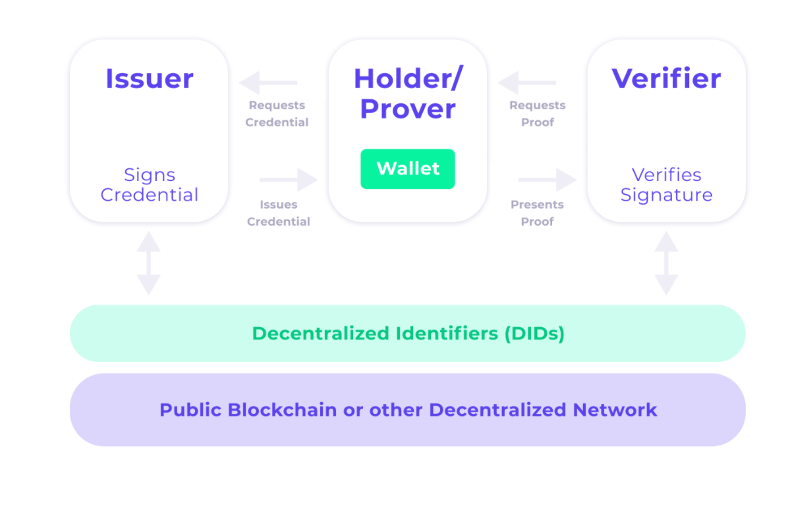
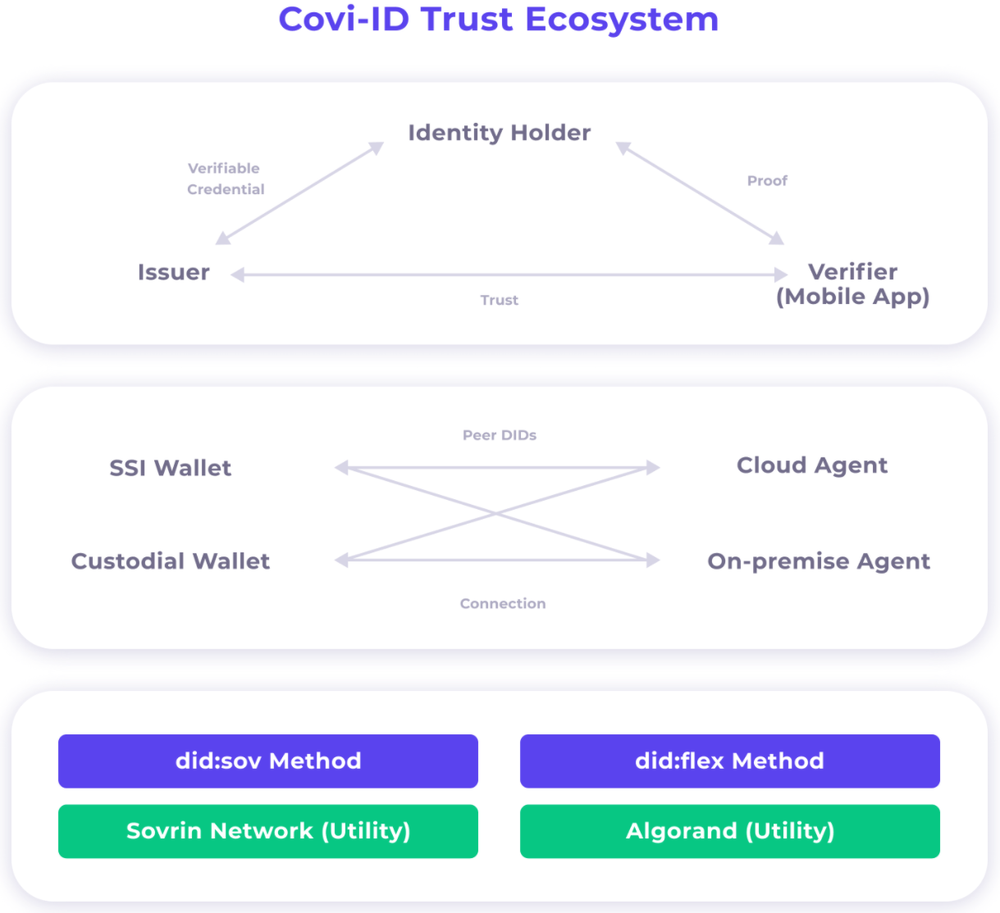
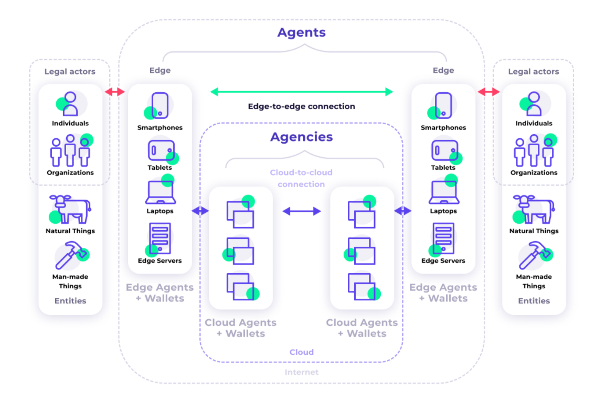

    

<h3>
    Covi-ID is an open source risk management tool designed to protect privacy.
</h3>

---

# Web App

This repository is for the web app of Covi-ID. This product was designed to preserve the privacy of its users, while still being able to prove you do not pose a public health risk. 

The other related repositories can be found here:
#### [> `API Core`](https://github.com/covi-id/cid-api-core)
#### [> `Mobile App`](https://github.com/covi-id/cid-mob-app)

# Index

####[How the app works](#how-the-app-works)
* [Privacy at the heart of the design](#privacy-at-the-heart-of-the-design)
* [Interoperability](#interoperability)

####[Project Details](#project-details)
* [Getting started](#getting-started)
* [Learn More About React App](#learn-more-about-react-app)

This project was bootstrapped with [Create React App](https://github.com/facebook/create-react-app).

---

# How the app works

## Privacy at the heart of the design

Users who have a cellphone are able to own their information through a self-sovereign wallet. Should a user not have a phone, a custodial wallet can be generated for them through a trusted third part, or through a friend who has a phone. 

The system is designed with 3 key players:
* The issuer who is the party that gives users credentials, such as a testing laboratory.
* The holder who is the user and owner of the wallet, or the provider of custodial wallet. 
* The verifier who checks users statuses, such as checking at roadblocks if you are an essential worker.

## Interoperability

This product was designed to give the user control over their data. Our system is designed to give as much control back to the user, allowing the user to claim their SSI and be in control of their data. If they are unable to claim their identity, a trusted set up is created to hold their wallet in a custodial manner. 

---

# Project Details

## Getting Started

In the project directory:

### 1. `npm install`

Install all the needed packages inside the project directory.

### 2. `npm start`

Runs the app in the development mode.
Open [http://localhost:3000](http://localhost:3000) to view it in the browser.

The page will reload if you make edits.
You will also see any lint errors in the console.

## Other Functionality

### `npm test`

Launches the test runner in the interactive watch mode.
See the section about [running tests](https://facebook.github.io/create-react-app/docs/running-tests) for more information.

### `npm run build`

Builds the app for production to the `build` folder.
It correctly bundles React in production mode and optimizes the build for the best performance.

The build is minified and the filenames include the hashes.
Your app is ready to be deployed!

See the section about [deployment](https://facebook.github.io/create-react-app/docs/deployment) for more information.

### `npm run eject`

**Note: this is a one-way operation. Once you `eject`, you can’t go back!**

If you aren’t satisfied with the build tool and configuration choices, you can `eject` at any time. This command will remove the single build dependency from your project.

Instead, it will copy all the configuration files and the transitive dependencies (`webpack`, `Babel`, `ESLint`, etc) right into your project so you have full control over them. All of the commands except `eject` will still work, but they will point to the copied scripts so you can tweak them. At this point you’re on your own.

You don’t have to ever use `eject`. The curated feature set is suitable for small and middle deployments, and you shouldn’t feel obligated to use this feature. However we understand that this tool wouldn’t be useful if you couldn’t customize it when you are ready for it.

### Learn More About React App

You can learn more in the [Create React App documentation](https://facebook.github.io/create-react-app/docs/getting-started).

To learn React, check out the [React documentation](https://reactjs.org/).

The various sections have moved:

* [Code Splitting](https://facebook.github.io/create-react-app/docs/code-splitting)
* [Analyzing the Bundle Size](https://facebook.github.io/create-react-app/docs/analyzing-the-bundle-size)
* [Making a Progressive Web App](https://facebook.github.io/create-react-app/docs/making-a-progressive-web-app)
* [Advanced Configuration](https://facebook.github.io/create-react-app/docs/advanced-configuration)
* [Deployment](https://facebook.github.io/create-react-app/docs/deployment)
* [`npm run build` fails to minify](https://facebook.github.io/create-react-app/docs/troubleshooting#npm-run-build-fails-to-minify)
